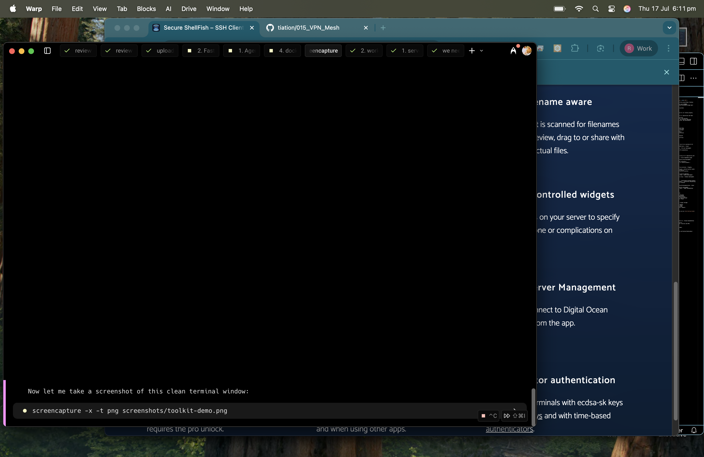

# Tiation macOS Toolkit

```
┌─────────────────────────────────────────────────────────────────────┐
│                    🚀 Tiation macOS Toolkit                        │
│                                                                     │
│  Enterprise-grade macOS terminal productivity toolkit               │
│  with intelligent zsh completions for developers                   │
│                                                                     │
│  ✨ Features: Swift, Xcode, BBEdit, GitHub CLI, Jamf Pro & more   │
└─────────────────────────────────────────────────────────────────────┘
```

**Enterprise-grade macOS terminal productivity toolkit with intelligent zsh completions**

Welcome to the Tiation macOS Toolkit! This comprehensive collection provides intelligent zsh completion files for macOS-specific commands and third-party developer tools, dramatically enhancing your terminal productivity.

## 🚀 Features

<div align="center">

| 🔧 **Developer Tools** | ⚙️ **System Administration** | 📱 **Mobile Development** | 🎯 **Enterprise Ready** |
|-------------------------|-------------------------------|---------------------------|-------------------------|
| Swift compiler & REPL  | Package installer             | Xcode integration         | Jamf Pro management     |
| BBEdit integration      | Software updates              | iOS development           | Policy management        |
| GitHub CLI support      | Property list utilities       | macOS app creation        | Device enrollment        |
| Project management      | System configuration          | Simulator control         | Compliance tools         |

</div>

- **🔧 Developer Tools**: Comprehensive completions for Xcode, Swift, BBEdit, and development utilities
- **⚙️ System Administration**: Complete coverage of macOS system commands like `installer`, `softwareupdate`, `plutil`
- **📱 Mobile Development**: Full support for iOS/macOS development workflows
- **🎯 Enterprise Ready**: Streamlined for professional development environments
- **🔄 Regular Updates**: Continuously updated with new tools and enhancements

## 📦 Available Completions

### Development Tools
| Tool | Description | Status |
|------|-------------|--------|
| `swift` | Swift compiler and REPL | ✅ Complete |
| `xed` | Xcode text editor | ✅ Complete |
| `xcrun` | Xcode command line tools | ✅ Complete |
| `bbedit` | BBEdit text editor | ✅ Complete |

### System Utilities
| Tool | Description | Status |
|------|-------------|--------|
| `installer` | macOS package installer | ✅ Complete |
| `softwareupdate` | System update utility | ✅ Complete |
| `plutil` | Property list utility | ✅ Complete |
| `PlistBuddy` | Property list editor | ✅ Complete |

### Third-Party Tools
| Tool | Description | Status |
|------|-------------|--------|
| `gh` | GitHub CLI | ✅ Complete |
| `jamf` | Jamf Pro management | ✅ Complete |
| `desktoppr` | Desktop management | ✅ Complete |
| `see` | File viewer utility | ✅ Complete |
| `project` | Project management | ✅ Complete |

## 🛠 Installation

### Quick Install (Recommended)

```zsh
# Clone the repository
git clone https://github.com/tiation/tiation-macos-toolkit.git ~/.tiation-macos-toolkit

# Add to your .zshrc
echo 'fpath=(~/.tiation-macos-toolkit/completions $fpath)' >> ~/.zshrc
echo 'autoload -U compinit && compinit' >> ~/.zshrc

# Reload your shell
source ~/.zshrc
```

### Installation Demo

```bash
$ git clone https://github.com/tiation/tiation-macos-toolkit.git ~/.tiation-macos-toolkit
Cloning into 'tiation-macos-toolkit'...
remote: Enumerating objects: 156, done.
remote: Total 156 (delta 67), reused 147 (delta 58)
Receiving objects: 100% (156/156), 45.23 KiB | 1.88 MiB/s, done.
Resolving deltas: 100% (67/67), done.

$ echo 'fpath=(~/.tiation-macos-toolkit/completions $fpath)' >> ~/.zshrc
$ source ~/.zshrc
✅ Installation complete!

$ swift --[TAB]
--build-path          --configuration        --destination
--enable-test-discovery --package-path      --verbose
```



### Manual Installation

1. **Download the toolkit:**
   ```zsh
   git clone https://github.com/tiation/tiation-macos-toolkit.git
   ```

2. **Update your `.zshrc`:**
   ```zsh
   # Add to your .zshrc file
   fpath=(/path/to/tiation-macos-toolkit/completions $fpath)
   autoload -U compinit && compinit
   ```

3. **Reload your configuration:**
   ```zsh
   source ~/.zshrc
   # If needed, clear completion cache
   rm ~/.zcompdump && compinit
   ```

### Install via [oh-my-zsh](https://github.com/robbyrussell/oh-my-zsh/)

1. **Clone as a plugin:**
   ```zsh
   git clone https://github.com/tiation/tiation-macos-toolkit.git "$ZSH_CUSTOM/plugins/tiation-macos-toolkit"
   ```

2. **Enable the plugin:**
   ```zsh
   # In your ~/.zshrc
   plugins=(... tiation-macos-toolkit)
   ```

3. **Restart your shell:**
   ```zsh
   source ~/.zshrc
   ```

## 🎯 Usage Examples

### Swift Development
```zsh
# Tab completion for Swift compiler options
swift build --<TAB>
# Shows: --build-path, --configuration, --verbose, etc.

# Tab completion for Swift package manager
swift package <TAB>
# Shows: init, build, test, clean, etc.
```

### Xcode Tools
```zsh
# Tab completion for xed (Xcode editor)
xed --<TAB>
# Shows: --create, --line, --column, etc.

# Tab completion for xcrun
xcrun --<TAB>
# Shows: --sdk, --toolchain, --find, etc.
```

### System Administration
```zsh
# Tab completion for installer
installer -pkg <TAB>
# Shows available .pkg files

# Tab completion for softwareupdate
softwareupdate --<TAB>
# Shows: --list, --install, --download, etc.
```

### Interactive Usage Demo

```bash
# Swift Development
$ swift build --[TAB]
--build-path          --configuration        --destination
--enable-test-discovery --package-path      --verbose

$ swift package [TAB]
clean    describe    init      resolve     test      update

# Xcode Tools
$ xed --[TAB]
--create    --line      --column    --wait     --find

$ xcrun --[TAB]
--sdk       --toolchain --find      --show-sdk-path

# System Administration
$ installer -pkg [TAB]
MyApp.pkg   Updates.pkg   Tools.pkg

$ softwareupdate --[TAB]
--install   --list      --download  --history   --schedule
```


## 🔧 Configuration

### Custom Completion Paths

You can customize the completion behavior by setting environment variables:

```zsh
# In your .zshrc
export TIATION_TOOLKIT_VERBOSE=1  # Enable verbose completion
export TIATION_TOOLKIT_CACHE=1    # Enable completion caching
```

### Performance Optimization

For better performance with large projects:

```zsh
# Enable completion caching
zstyle ':completion:*' use-cache on
zstyle ':completion:*' cache-path ~/.zsh/cache
```

## 🚀 Advanced Features

### Intelligent Context Awareness
- Completions adapt based on current directory context
- Project-specific completions for Xcode projects
- Git repository awareness for development tools

### Enterprise Integration
- Jamf Pro management tool completions
- Enterprise deployment script support
- System administration utilities

## 🤝 Contributing

We welcome contributions! Here's how to get started:

1. **Fork the repository**
2. **Create a feature branch:** `git checkout -b feature/new-completion`
3. **Add your completion file** to the `completions/` directory
4. **Test thoroughly** with various scenarios
5. **Submit a pull request** with detailed description

### Completion File Guidelines

- Follow zsh completion conventions
- Include comprehensive option coverage
- Add context-aware completions where possible
- Document any special requirements

## 📋 Roadmap

### Coming Soon
- [ ] `xcodebuild` - Xcode build system
- [ ] `diskutil` - Disk utility management
- [ ] `launchctl` - Launch daemon control
- [ ] `profiles` - Configuration profiles
- [ ] `tccutil` - Transparency, Consent, and Control

### Under Development
- [ ] `log` - macOS unified logging
- [ ] `sysadminctl` - System administration
- [ ] `tmutil` - Time Machine utility
- [ ] `createinstallmedia` - macOS installer creation

## 📚 Documentation

- [Installation Guide](docs/installation.md)
- [Usage Examples](docs/usage.md)
- [Contributing Guidelines](docs/contributing.md)
- [API Reference](docs/api.md)

## 🐛 Troubleshooting

### Common Issues

**Completions not working:**
```zsh
# Clear completion cache
rm ~/.zcompdump
compinit
```

**Slow completion performance:**
```zsh
# Enable completion caching
zstyle ':completion:*' use-cache on
```

**Conflicts with other plugins:**
```zsh
# Load tiation-macos-toolkit last in your plugins array
plugins=(other-plugins tiation-macos-toolkit)
```

## 📞 Support & Discussion

- **Issues & Bug Reports**: [GitHub Issues](https://github.com/tiation/tiation-macos-toolkit/issues)
- **Feature Requests**: [GitHub Discussions](https://github.com/tiation/tiation-macos-toolkit/discussions)
- **Community Chat**: `#zsh` channel on [MacAdmins Slack](http://macadmins.org)
- **Documentation**: [Wiki](https://github.com/tiation/tiation-macos-toolkit/wiki)

## 📜 License

This project is licensed under the MIT License - see the [LICENSE](LICENSE) file for details.

## 🙏 Acknowledgments

- Original project by [scriptingosx](https://github.com/scriptingosx)
- macOS development community
- Contributors and testers

---

<div align="center">

**Made with ❤️ for macOS developers and system administrators**

```
┌─────────────────────────────────────────────────────────────────────┐
│                                                                     │
│             🚀 Tiation macOS Toolkit                               │
│                                                                     │
│  🔧 Enterprise-grade  📱 Developer-focused  ⚙️ System-ready        │
│                                                                     │
│     Join the community • Contribute • Build amazing tools          │
│                                                                     │
│               github.com/tiation/tiation-macos-toolkit          │
│                                                                     │
└─────────────────────────────────────────────────────────────────────┘
```

</div>
